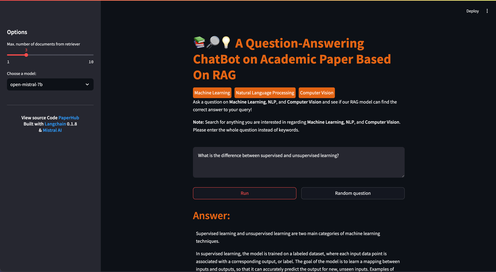
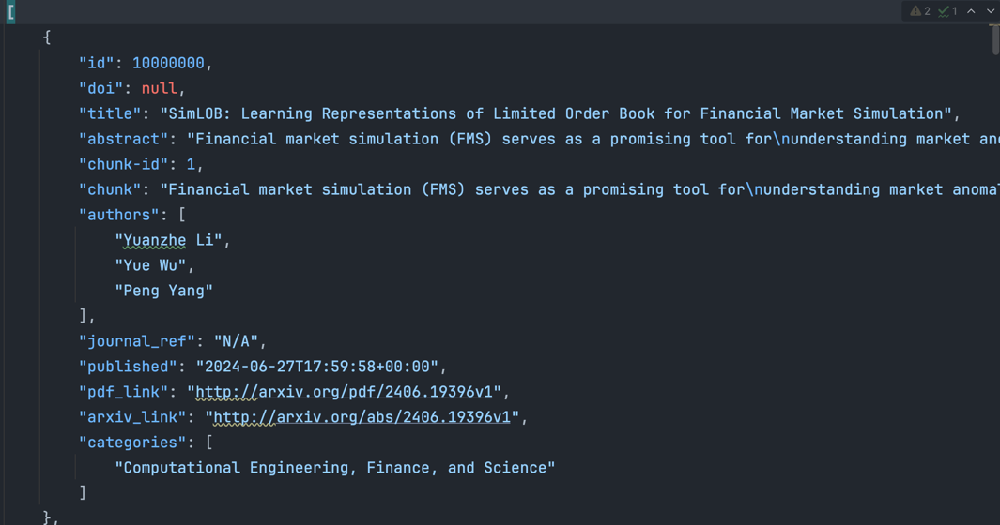
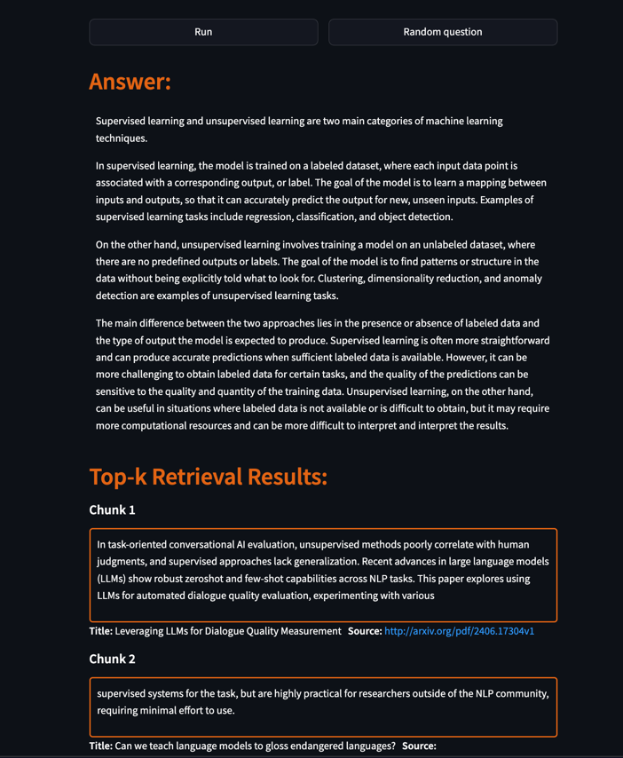

# A Medical Question-Answering Demo Based On RAG
A QA system for the medical field on <em>Intelligence</em>, utilizing the RAG model, 
langchain for chunking texts, Pinecone for vector storage, and ChatGPT for generating answers.



## Table of Contents
- [Get Started](#get-started)
- [Dataset](#dataset)
- [Pipeline](#pipeline)

## Get Started
1. install all the dependencies
```bash
git clone https://github.com/CoreSheep/PaperHub.git
cd ./src
pip install .
```
2. run the webapp
```bash
cd ./src
streamlit run webapp_mistral.py
```


## Dataset

- Dataset description
    - data source: [pubmed](https://pubmed.ncbi.nlm.nih.gov/)
    - data format:
      - id
      - Title
      - Author
      - Chunk-id
      - source
      - Journal Title
      - Publication Date
      - Chunk
- Example

- Text splitter
  - We use our customized text splitter to get the small-size chunk
```python
def custom_text_splitter(text, chunk_size):
    """Split the text into chunks of specified size."""
    text_splitter = CharacterTextSplitter(
        separator="\n",
        chunk_size=chunk_size,
        chunk_overlap=20
    )
    return text_splitter.create_documents(text)
```

## Pipeline
This pipeline is based on [langchain](https://python.langchain.com/docs/get_started/introduction), which is an opensource nlp framework.
- Initializing pinecone vector store
```python
# Initializing the Pinecone vector store
def load_vectorstore(self):
    from pinecone import Pinecone
    return Pinecone(api_key=self.PINECONE_API_KEY)
```
- Initializing embedding model for creating embeddings of chunk
```python
# We use ada as our embed model
self.embedding_model = "text-embedding-ada-002" 
self.embed_model = OpenAIEmbeddings(model=self.embedding_model, api_key=self.OPENAI_API_KEY)
```

- Creating index
```python
# check if index already exists (it shouldn't if this is first time)
if self.index_name not in existing_indexes:
    # if does not exist, create index
    vector_store.create_index(
        self.index_name,
        dimension=1536,  # dimensionality of ada 002
        metric='dotproduct',
        spec=self.spec
    )
```

- Upsert all the embeddings to pinecone in batch
```python
for i in tqdm(range(0, len(dataset), batch_size)):
    i_end = min(len(dataset), i + batch_size)
    # Get batch of data
    batch = dataset.iloc[i:i_end]

    # Generate unique ids for each chunk
    ids = [f"{x['id']}-{x['chunk-id']}" for _, x in batch.iterrows()]
    # Get text to embed
    texts = [x['chunk'] for _, x in batch.iterrows()]
    # Embed text
    embeds = self.embed_model.embed_documents(texts)

    # Get metadata to store in Pinecone
    metadata = [
        {'text': x['chunk'],
         'source': x['pdf_link'],
         'title': x['title'],
         'authors': ', '.join(x['authors']),
         'journal_ref': x['journal_ref'],
         'published': x['published']
         } for _, x in batch.iterrows()
    ]
    # Add to Pinecone
    index.upsert(vectors=zip(ids, embeds, metadata))
```

- Answering
```python
chatbot = PaperChatbot()
# data = chatbot.load_data()
vc = chatbot.load_vectorstore()
# index = chatbot.create_index(vc, data, batch_size=100)
index = chatbot.get_index(vc)
chatbot.query(index, question, top_k_retriever, text_field, chat_model_selected)
```



# References
[Mistral Documentation](https://docs.mistral.ai/capabilities/completion/)
[Langchain Documentation](https://python.langchain.com/docs/get_started/introduction)
[Pinecone Documentation](https://docs.pinecone.io/docs/overview)
[OpenAI Documentation](https://platform.openai.com/docs/api-reference)
[Streamlit Documentation](https://docs.streamlit.io/)
